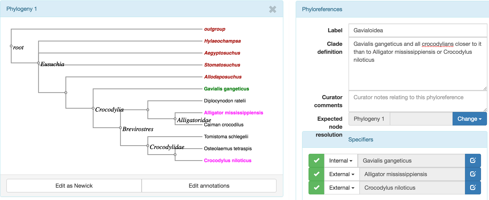
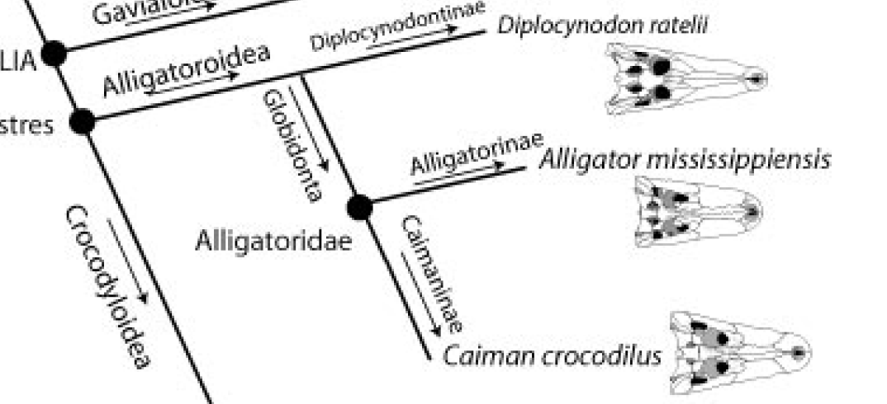
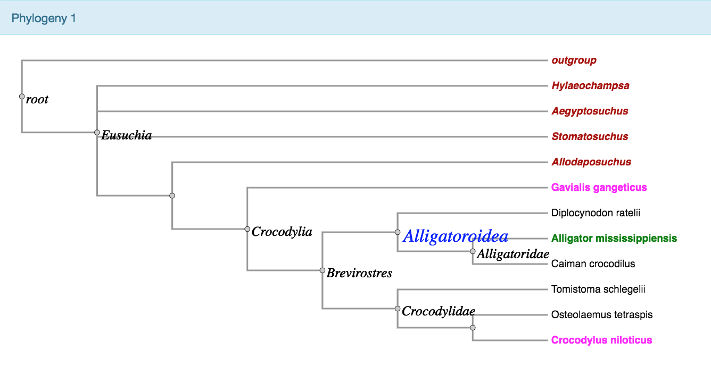

## Phyloreference curation experiment 

* Experiment to curate PCD (phylogenetic clade definitions) in Brochu (2003)
* Time needed for tree transcription, phyloreference entry, and validation recorded
* Software and conceptual issues documented

---

### Time breakdown
* Newick tree transcription - 40 min
* Enter study details - 5 min
* Each phyloreference with initial validation - 2 to 5 min
* Overall validation - 

---

### Some conceptual issues (not directly bearing on curation)

---

Internal node is absent

---
Alligatoroidea as a stem-based definition is labeled along branch, not at a node: "Alligator mississippiensis and all crocodylians closer to it than to Crocodylus niloticus or Gavialis gangeticus."

---

Mapping in curation tool

---

### New curation tool features needed

1. Box to enter comments on definition (from paper/original author)
 

---
Current curation panel for a "phyloreference"

